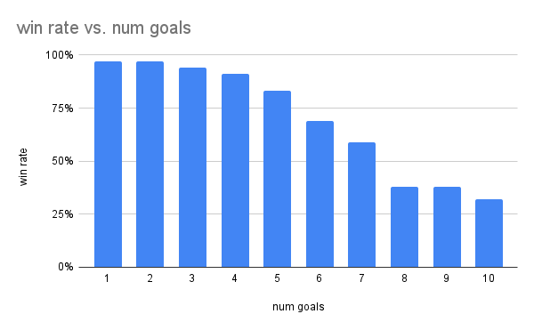

# Crew MCTS

## Acknoledgements
A special thanks to int8 for their pure python implementation of monte-carlo tree search.
I used this code as a base for the MCTS/Decistion-tree hybrid model I describe below.
https://github.com/int8/monte-carlo-tree-search

Thanks to Thomas Sing for creating the game "The Crew" which inspired this project.

## The Game

This package implements a Monte-carlo tree search algorithm paired with a Decision 
Tree algorithm to learn how to play trick-taking, cooperative card game "The Crew".

In "The Crew", players work together to accomplish randomized objectives
of varying difficulty by playing cards from their hand and winning tricks 
containing specific mission cards. Even though the premise is simple, the 
strategy is complex, especially when playing with several missions. 
A more detailed description of the game can be found here: 
https://boardgamegeek.com/boardgame/284083/crew-quest-planet-nine

## Method

The monte-carlo tree search algorithm is ideally suited for this game because
the parameter space is too large for brute force and, generally, the best
strategy involves looking several steps ahead for the path to victory. 
Since the game is cooperative nodes in the tree are all trying to find the highest
chance of joint success rather than in a competitive two player game when
nodes alternate by trying to maximize their own chance of success.

The randomized simulated playouts sometimes used in monte-carlo tree searches was
not well-suited to this game because it biases the chance of success to be extremely low.
It is very unlikely to win this game through random moves. Instead, I iteratively
trained a Decision Tree algorithm to estimate the likelihood of winning at
the start of each round.

The initial dataset was randomly generated game states for the final round when
the parameter space is very small. A monte-carlo tree search is used to determine
if the game can be won or not. After training a decision tree on this dataset,
a new dataset of game states on the second to last round are created. Again, 
monte carlo tree search is used to determine whether the game is solveable, but
the first decision tree is used for simulated playouts. I repeated this process until
I had a dataset for every round of the game.

## Results

After training the final iteration of the Decision Tree, I ran 100 simulations
for each number of mission card goals. The original game never exceeds 10 mission
cards so I made that my maximum difficulty case. The resulting win rate
is higher than most human players, and the algorithm even performs decently at
the maximum difficulty.

